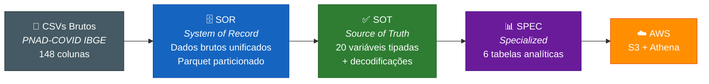
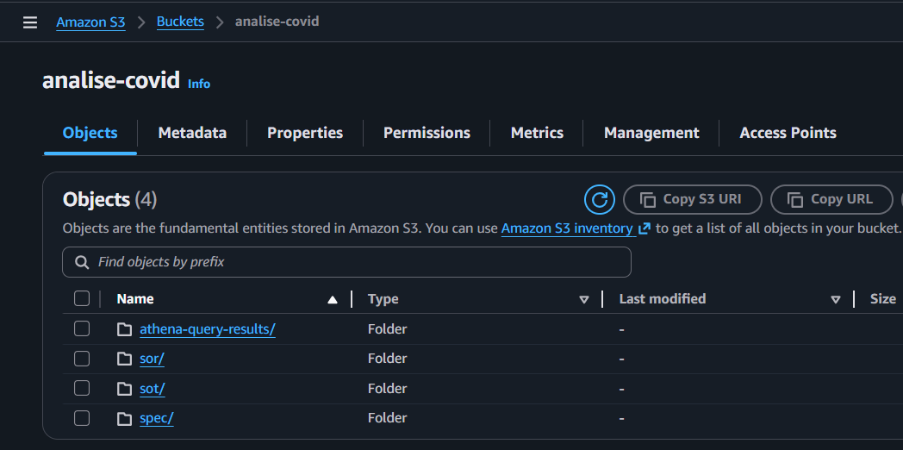
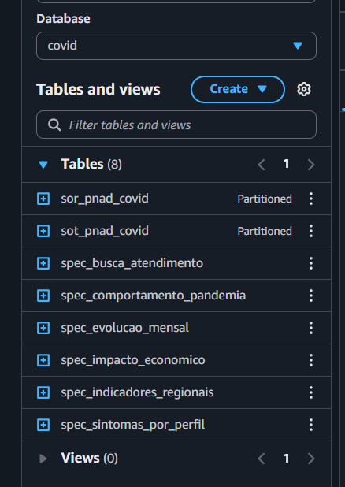
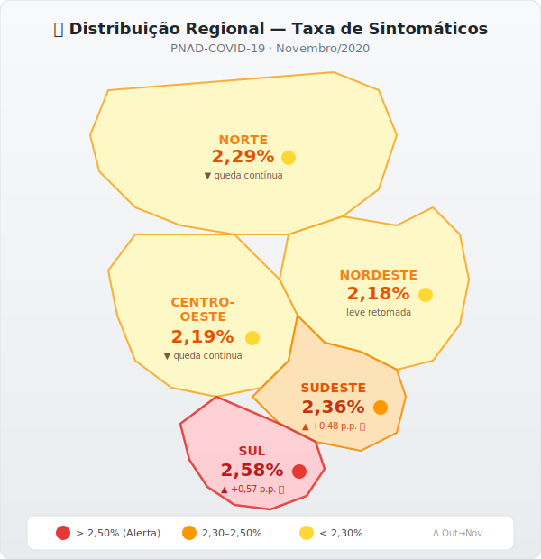
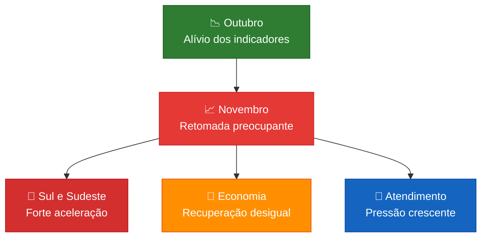

<p align="center">
  
  
  
  
</p>

# 🏥 Tech Challenge 3 — Análise do Impacto da COVID-19 no Brasil

### PNAD-COVID-19 (IBGE) · Setembro a Novembro de 2020 · 1.149.197 registros

> **Objetivo:** Analisar os microdados da pesquisa PNAD-COVID-19, respondendo a questionamentos sobre sintomas clínicos, busca por atendimento, perfil socioeconômico, comportamento da população e distribuição regional da pandemia — utilizando um pipeline de dados em nuvem (AWS S3 + Athena) com arquitetura em camadas.

---

## 📑 Índice

- [Contexto e Questionamentos](#-contexto-e-questionamentos)
- [Uso do Dicionário PNAD-COVID](#-uso-do-dicionário-pnad-covid)
- [Arquitetura do Pipeline](#%EF%B8%8F-arquitetura-do-pipeline)
  - [Amostra dos Dados](#-amostra-dos-dados)
- [Infraestrutura AWS](#-infraestrutura-aws)
- [Storytelling dos Dados](#-storytelling-dos-dados)
  - [1. Evolução dos Sintomas](#1-como-evoluíram-os-sintomas-clínicos-ao-longo-do-trimestre)
  - [2. Perfil dos Sintomáticos](#2-qual-o-perfil-demográfico-mais-afetado-por-sintomas)
  - [3. Busca por Atendimento](#3-as-pessoas-procuraram-atendimento-médico)
  - [4. Internações](#4-quantos-foram-internados)
  - [5. Distribuição Regional](#5-como-a-pandemia-se-distribuiu-pelo-brasil)
  - [6. Impacto Econômico](#6-qual-o-impacto-econômico-na-população)
  - [7. Comportamento na Pandemia](#7-como-a-população-se-comportou)
- [Conclusões e Recomendações](#-conclusões)
- [Como Executar](#-como-executar)
- [Estrutura do Repositório](#-estrutura-do-repositório)
- [Tecnologias](#-tecnologias)

---

## 🎯 Contexto e Questionamentos

O **Tech Challenge Fase 3** da Pós-Graduação FIAP propõe a análise dos microdados da **PNAD-COVID-19 (IBGE)** com foco em responder:

| # | Questionamento |
|:-:|---|
| 1 | Quais os sintomas clínicos da população e como evoluíram ao longo dos meses? |
| 2 | Qual o perfil demográfico (idade, sexo, escolaridade) mais afetado? |
| 3 | A população procurou atendimento médico? Em que proporção? |
| 4 | Quantas pessoas foram internadas? |
| 5 | Como os indicadores se distribuem regionalmente pelo Brasil? |
| 6 | Qual o impacto na economia (trabalho, renda, benefícios sociais)? |
| 7 | Como a população se comportou em relação ao isolamento? |

**Fonte dos dados:** [IBGE — PNAD COVID-19](https://www.ibge.gov.br/estatisticas/sociais/saude/27946-divulgacao-semanal-pnadcovid1.html)

**Período analisado:** Setembro, Outubro e Novembro de 2020

**Volume total:** **1.149.197** registros individuais cobrindo as **27 UFs** brasileiras

---

## 📖 Uso do Dicionário PNAD-COVID

A base PNAD-COVID-19 é disponibilizada pelo IBGE com **148 colunas codificadas** (ex.: `B0011`, `A002`, `C001`). Para transformar esses códigos em informação interpretável, utilizamos o **Dicionário de Variáveis** oficial do IBGE, que mapeia cada coluna ao seu significado e cada valor numérico à sua descrição.

### Como o dicionário foi aplicado no pipeline

| Etapa | O que foi feito | Exemplo |
|-------|----------------|---------|
| **Seleção de variáveis** | Das 148 colunas originais, selecionamos **20 variáveis-chave** com base no dicionário, cobrindo: dados demográficos (seção A), sintomas e saúde (seção B), trabalho (seção C), renda (seção D), benefícios (seção E) e comportamento (seção F) | `B0011` → sintoma de febre, `A002` → idade, `C001` → trabalhou na semana |
| **Decodificação de valores** | Códigos numéricos foram convertidos em descrições legíveis seguindo o dicionário | `1` → **Sim**, `2` → **Não**, `9` → Ignorado |
| **Mapeamento de UF** | Códigos IBGE das UFs (11 a 53) foram mapeados para nome do estado e macro-região | `11` → Rondônia (Norte), `35` → São Paulo (Sudeste) |
| **Descrições demográficas** | Campos como sexo, cor/raça e escolaridade receberam rótulos descritivos | `sexo=1` → Masculino, `cor_raca=4` → Parda, `escolaridade=5` → Médio completo |
| **Faixas etárias** | A idade contínua (`A002`) foi agrupada em faixas para facilitar análises por perfil | `36 anos` → faixa `30-39` |

> 📌 Todo o mapeamento de códigos está implementado no script [sot/script_sot.py](sot/script_sot.py), que realiza a transformação da camada SOR para SOT.

### Estrutura do questionário PNAD-COVID

| Seção | Tema | Variáveis selecionadas |
|:-----:|------|------------------------|
| **A** | Dados demográficos | `A002` (idade), `A003` (sexo), `A004` (cor/raça), `A005` (escolaridade) |
| **B** | Sintomas e saúde | `B0011`–`B0019` (sintomas), `B002` (procurou saúde), `B005` (internação), `B007` (plano de saúde) |
| **C** | Trabalho | `C001` (trabalhou), `C013` (trabalho remoto) |
| **D** | Rendimentos | — (usados indiretamente) |
| **E** | Benefícios | `E001` (Bolsa Família), `E0021`–`E0024` (auxílio emergencial) |
| **F** | Comportamento | `F001` (restrição de contato) |

---

## ⚙️ Arquitetura do Pipeline

O pipeline segue a arquitetura **SOR → SOT → SPEC** em 3 camadas, processando os dados brutos até visões analíticas especializadas:



| Camada | Registros | Colunas | Formato | Partição | Script |
|--------|----------:|--------:|---------|----------|--------|
| **SOR** | 1.149.197 | 148 | Parquet Snappy | `ano_mes` | [script_sor.py](sor/script_sor.py) |
| **SOT** | 1.149.197 | 42 | Parquet Snappy | `ano_mes` | [script_sot.py](sot/script_sot.py) |
| **SPEC** | 6 tabelas | variável | Parquet Snappy | — | [script_spec.py](spec/script_spec.py) |

### Tabelas SPEC Geradas

| Tabela | Finalidade | Chaves |
|--------|------------|--------|
| `spec_sintomas_por_perfil` | Sintomas × demografia × mês | faixa_etaria, sexo, regiao |
| `spec_busca_atendimento` | Atendimento hospitalar × perfil | faixa_etaria, sexo, regiao |
| `spec_impacto_economico` | Trabalho, renda e benefícios | faixa_etaria, sexo, escolaridade |
| `spec_comportamento_pandemia` | Isolamento e exposição | faixa_etaria, sexo, regiao |
| `spec_indicadores_regionais` | Consolidado por UF/Região | uf, nome_uf, regiao |
| `spec_evolucao_mensal` | KPIs mensais consolidados | ano_mes |

### 🔍 Amostra dos Dados

Para ilustrar a transformação dos dados em cada camada, veja abaixo amostras reais do pipeline:

#### Camada SOR — Dados brutos (148 colunas codificadas)

> Abaixo, 3 registros da [camada SOR](sor/preview/sor_preview_202009.csv) mostrando apenas 10 das 148 colunas originais. Os valores são códigos numéricos sem tratamento.

| Ano | UF | A002 (idade) | A003 (sexo) | A004 (cor) | A005 (escol.) | B0011 (febre) | B0012 (tosse) | B002 (proc. saúde) | C001 (trabalhou) |
|:---:|:--:|:---:|:---:|:---:|:---:|:---:|:---:|:---:|:---:|
| 2020 | 11 | 036 | 1 | 4 | 5 | 2 | 2 | — | 1 |
| 2020 | 11 | 030 | 2 | 4 | 7 | 2 | 2 | — | 1 |
| 2020 | 11 | 013 | 1 | 4 | 2 | 2 | 2 | — | — |

<sub>💡 Legenda: sexo (1=Masculino, 2=Feminino) · cor (1=Branca, 4=Parda) · sintomas (1=Sim, 2=Não) · escolaridade (2=Fund. incompleto, 5=Médio completo, 7=Superior completo)</sub>

#### Camada SOT — Dados tratados e decodificados (42 colunas)

> Após o tratamento pelo [script_sot.py](sot/script_sot.py), os códigos são substituídos por descrições legíveis. Veja amostra da [camada SOT](sot/preview/sot_preview_202009.csv):

| UF | nome_uf | regiao | idade | sexo_desc | cor_raca_desc | escolaridade_desc | faixa_etaria | febre | tosse |
|:--:|---------|--------|:-----:|-----------|---------------|-------------------|:------------:|:-----:|:-----:|
| 11 | Rondônia | Norte | 36 | Masculino | Parda | Médio completo | 30-39 | Não | Não |
| 11 | Rondônia | Norte | 30 | Feminino | Parda | Superior completo | 30-39 | Não | Não |
| 11 | Rondônia | Norte | 57 | Feminino | Branca | Fund. incompleto | 50-59 | Não | Não |

#### Camada SPEC — Tabelas analíticas agregadas

> A tabela `spec_evolucao_mensal` consolida KPIs por mês. Gerada pelo [script_spec.py](spec/script_spec.py). Amostra da [camada SPEC](spec/preview/spec_evolucao_mensal_preview.csv):

| ano_mes | mes_desc | total_pessoas | sintomáticos | % sint. | % febre | % tosse | % proc. saúde | % trabalhou | % auxílio |
|:-------:|----------|:------------:|:------------:|:-------:|:-------:|:-------:|:-------------:|:-----------:|:---------:|
| 202009 | Setembro/2020 | 387.298 | 9.444 | **2,44%** | 0,80% | 1,43% | 1,06% | 36,27% | 6,67% |
| 202010 | Outubro/2020 | 380.461 | 7.957 | **2,09%** | 0,73% | 1,20% | 0,96% | 37,09% | 7,39% |
| 202011 | Novembro/2020 | 381.438 | 8.833 | **2,32%** | 0,83% | 1,38% | 1,06% | 37,40% | 8,08% |

---

## ☁️ Infraestrutura AWS

Os dados foram armazenados no **Amazon S3** (bucket `analise-covid`) e catalogados no **Amazon Athena** (database `covid`) para consultas SQL analíticas.

### Bucket S3 — `s3://analise-covid/`

<p align="center">
  
</p>

```
s3://analise-covid/
├── sor/sor_pnad_covid/ano_mes=202009/  → Dados brutos particionados
├── sor/sor_pnad_covid/ano_mes=202010/
├── sor/sor_pnad_covid/ano_mes=202011/
├── sot/sot_pnad_covid/ano_mes=202009/  → Dados tratados particionados
├── sot/sot_pnad_covid/ano_mes=202010/
├── sot/sot_pnad_covid/ano_mes=202011/
├── spec/spec_sintomas_por_perfil/      → Tabelas analíticas
├── spec/spec_busca_atendimento/
├── spec/spec_impacto_economico/
├── spec/spec_comportamento_pandemia/
├── spec/spec_indicadores_regionais/
├── spec/spec_evolucao_mensal/
└── athena-query-results/               → Resultados de queries
```

### Athena — Database `covid` (8 tabelas)

<p align="center">
  
</p>

---

## 📊 Storytelling dos Dados

### 1. Como evoluíram os sintomas clínicos ao longo do trimestre?

> **Resposta:** Outubro trouxe alívio, mas novembro sinalizou retomada preocupante.

<p align="center">
  
</p>

| Sintoma | Set/2020 | Out/2020 | Nov/2020 | Tendência |
|---------|:--------:|:--------:|:--------:|:---------:|
| **Pelo menos 1 sintoma** | 2,44% | 2,09% | **2,32%** | 📈 Retomada |
| Febre | 0,80% | 0,73% | **0,83%** | 📈 Retomada |
| Tosse | 1,43% | 1,20% | **1,38%** | 📈 Retomada |
| Dor de garganta | 1,09% | 1,02% | **1,17%** | 📈 Retomada |
| Dificuldade respiratória | 0,47% | 0,38% | 0,40% | ➡️ Estável |
| Perda de cheiro/sabor | 0,42% | 0,35% | 0,38% | ➡️ Estável |

**Análise:** A taxa de sintomáticos caiu de **2,44%** em setembro para **2,09%** em outubro (−0,35 p.p.), mas reverteu a tendência em novembro atingindo **2,32%** (+0,23 p.p.). A febre foi o sintoma que mais reacelerou, ultrapassando o patamar de setembro. A dificuldade respiratória — indicador de gravidade — manteve-se abaixo de set/2020, sugerindo que a retomada inicial foi de quadros mais leves.

---

### 2. Qual o perfil demográfico mais afetado por sintomas?

> **Resposta:** Adultos de 30-39 anos, mulheres e população do Centro-Oeste foram os mais afetados.

<p align="center">
  
</p>

<p align="center">
  
</p>

| Recorte | Destaque |
|---------|----------|
| **Faixa etária** | 30-39 anos com **2,61%** — maior taxa de sintomáticos |
| **Grupo de risco** | 70+ com **2,45%** — segunda maior taxa |
| **Sexo** | Feminino (**2,46%**) supera masculino (**2,09%**) |
| **Jovens** | 0-17 anos: menor taxa (**1,69%**) |

**Análise:** A faixa 30-39 anos lidera em prevalência de sintomas, provavelmente por ser a mais exposta em ambientes de trabalho. Os idosos 70+ apresentam a segunda maior taxa, combinando vulnerabilidade clínica com incidência elevada. Mulheres reportam mais sintomas que homens — o que pode refletir tanto maior sensibilidade ao relato quanto maior exposição (papel de cuidadoras).

---

### 3. As pessoas procuraram atendimento médico?

> **Resposta:** Sim, cerca de 1% da população procurou atendimento, com pico em setembro e novembro.

<p align="center">
  
</p>

| Indicador | Set/2020 | Out/2020 | Nov/2020 |
|-----------|:--------:|:--------:|:--------:|
| Procurou serviço de saúde | **1,06%** | 0,96% | **1,06%** |
| Possui plano de saúde | 2,89% | 4,50% | 4,68% |

**Análise:** A busca por atendimento caiu em outubro (0,96%) acompanhando a queda de sintomas, mas retornou ao patamar de setembro (1,06%) em novembro. A cobertura de planos de saúde teve aumento expressivo no período, possivelmente refletindo a conscientização da população sobre a importância de acesso a saúde.

---

### 4. Quantos foram internados?

> **Resposta:** A taxa de internação foi baixa (0,01%), mas a gravidade entre sintomáticos variou.

| Indicador | Set/2020 | Out/2020 | Nov/2020 |
|-----------|:--------:|:--------:|:--------:|
| Taxa de internação geral | 0,01% | 0,01% | 0,01% |
| **Internação entre sintomáticos** | **0,50%** | **0,55%** | **0,44%** |

<p align="center">
  
</p>

**Análise:** Embora a taxa geral de internação tenha se mantido em 0,01%, quando filtramos apenas os sintomáticos, outubro teve a maior taxa de internação (**0,55%**), indicando que, apesar de menos casos, os que adoeceram tiveram quadros proporcionalmente mais graves. Novembro reverteu para 0,44%, sugerindo que a retomada de sintomas foi predominantemente de casos leves.

Em números absolutos: **47** internados em setembro (de 9.444 sintomáticos), **44** em outubro (de 7.957) e **39** em novembro (de 8.833).

---

### 5. Como a pandemia se distribuiu pelo Brasil?

> **Resposta:** Norte e Centro-Oeste lideraram em setembro, mas Sul e Sudeste tiveram forte retomada em novembro.

<p align="center">
  
</p>

#### 🗺️ Mapa do Brasil — Taxa de Sintomáticos por Região (Nov/2020)

<p align="center">
  
</p>

#### Variação Out → Nov (pontos percentuais)

| Região | Out/2020 | Nov/2020 | **Δ (p.p.)** | Alerta |
|--------|:--------:|:--------:|:------------:|:------:|
| **Sul** | 2,01% | 2,58% | **+0,57** | 🔴 |
| **Sudeste** | 1,88% | 2,36% | **+0,48** | 🔴 |
| Nordeste | 2,08% | 2,18% | +0,10 | 🟡 |
| Centro-Oeste | 2,23% | 2,19% | −0,04 | 🟢 |
| Norte | 2,59% | 2,29% | −0,30 | 🟢 |

**Análise:** Enquanto Norte e Centro-Oeste mantiveram trajetória de queda contínua, o **Sul** e **Sudeste** apresentaram forte retomada em novembro. O Sul saltou de 2,01% para **2,58%** (+0,57 p.p.), tornando-se a região com maior taxa. O Sudeste foi de 1,88% para 2,36% (+0,48 p.p.). Esse movimento antecipou a segunda onda que viria a pressionar o sistema de saúde no início de 2021.

#### Destaques por UF (Nov/2020)

Abaixo, as UFs com maiores taxas de sintomáticos em novembro:

<p align="center">
  
</p>

---

### 6. Qual o impacto econômico na população?

> **Resposta:** A ocupação cresceu levemente, mas a dependência de auxílio emergencial aumentou de forma expressiva.

<p align="center">
  
</p>

| Indicador | Set/2020 | Out/2020 | Nov/2020 | Variação |
|-----------|:--------:|:--------:|:--------:|:--------:|
| Trabalhou na semana | 36,27% | 37,09% | **37,40%** | +1,13 p.p. |
| Trabalho remoto | 36,66% | 37,11% | 37,29% | +0,63 p.p. |
| Auxílio emergencial | 6,67% | 7,39% | **8,08%** | **+1,41 p.p.** |
| Bolsa Família | 4,99% | 4,93% | 4,99% | estável |

**Análise:** A taxa de ocupação cresceu de 36,27% para 37,40%, sinalizando recuperação gradual do mercado de trabalho. No entanto, a demanda por **auxílio emergencial subiu 1,41 p.p.** no mesmo período — de 6,67% para **8,08%** — revelando que a recuperação econômica não alcançou os mais vulneráveis. O Bolsa Família permaneceu estável (~5%), funcionando como rede de proteção permanente. A proporção de trabalho remoto entre ocupados ficou estável (~37%).

---

### 7. Como a população se comportou?

> **Resposta:** A maioria reduziu contato, mas sintomáticos continuaram trabalhando em proporção crescente.

<p align="center">
  
</p>

| Comportamento | Set/2020 | Out/2020 | Nov/2020 |
|---------------|:--------:|:--------:|:--------:|
| Ficou em casa rigorosamente | 0,05% | 0,05% | 0,05% |
| Reduziu contato | 0,43% | 0,43% | 0,49% |
| Levou vida normal | ~0% | 0,01% | 0,01% |
| **Sintomáticos trabalhando** | 0,52% | **0,49%** | **0,60%** |

**Análise:** O percentual de pessoas com febre ou tosse que continuaram trabalhando subiu de **0,49%** em outubro para **0,60%** em novembro — um aumento de 22% que eleva o risco de transmissão ocupacional. A adesão ao isolamento rigoroso permaneceu estável e baixa (0,05%), enquanto a parcela que reduziu contato subiu ligeiramente.

---

## 🏁 Conclusões

### Panorama Geral



### Respostas Consolidadas

| Questionamento | Achado Principal |
|:-:|---|
| **Sintomas** | Retomada em novembro (2,32%) após alívio em outubro (2,09%). Febre reacelerou acima de setembro. |
| **Perfil** | 30-39 anos (2,61%) e 70+ (2,45%) são os mais vulneráveis. Mulheres > Homens. |
| **Atendimento** | ~1% procurou serviço de saúde. Novembro voltou ao patamar de setembro. |
| **Internações** | 0,01% geral. Entre sintomáticos: 0,44-0,55%. Outubro teve maior gravidade proporcional. |
| **Regional** | Sul (+0,57 p.p.) e Sudeste (+0,48 p.p.) com forte retomada em novembro. |
| **Economia** | Ocupação cresceu (+1,13 p.p.) mas auxílio emergencial subiu mais (+1,41 p.p.). |
| **Comportamento** | Sintomáticos trabalhando subiram 22% em novembro (0,60%). Isolamento rigoroso ficou estável. |

### Recomendações

1. **Preparar capacidade hospitalar** em meses de reversão de tendência — novembro reverteu outubro com margem de +0,23 p.p.
2. **Priorizar Sul e Sudeste** em triagem respiratória — maior aceleração regional
3. **Expandir telemonitoramento** — 1,06% procurou saúde, mas apenas 0,01% internou (maioria é triável remotamente)
4. **Monitorar sintomáticos em atividade laboral** — 0,60% com febre/tosse continuou trabalhando
5. **Integrar risco social no cuidado** — 8,08% dependem de auxílio emergencial, populações vulneráveis postergam atendimento

---

## 🚀 Como Executar

### Pré-requisitos

| Ferramenta | Versão |
|------------|--------|
| Python | 3.11+ |
| Java | 21+ (para Spark) |
| PySpark | 4.x |
| pandas + pyarrow | — |

### Pipeline Local

```bash
# 1. Camada SOR - Ingestão dos dados brutos
python sor/script_sor.py

# 2. Camada SOT - Tratamento e normalização
python sot/script_sot.py

# 3. Camada SPEC - Geração das tabelas analíticas
python spec/script_spec.py
```

> Scripts: [script_sor.py](sor/script_sor.py) → [script_sot.py](sot/script_sot.py) → [script_spec.py](spec/script_spec.py)

### Deploy no Athena

Após upload dos Parquets para o S3 (`s3://analise-covid/`), execute os DDLs:

- [📝 sor/create_sor_pnad_covid.sql](sor/create_sor_pnad_covid.sql)
- [📝 sot/athena_create_table_sot.sql](sot/athena_create_table_sot.sql)
- [📝 spec/athena_create_table_spec.sql](spec/athena_create_table_spec.sql)

---

## 📁 Estrutura do Repositório

```
tech-challenge-3-big-data/
├── README.md
├── .gitignore
├── sor/
│   ├── script_sor.py
│   ├── create_sor_pnad_covid.sql
│   └── preview/
├── sot/
│   ├── script_sot.py
│   ├── athena_create_table_sot.sql
│   └── preview/
├── spec/
│   ├── script_spec.py
│   ├── athena_create_table_spec.sql
│   ├── querys_analise_spec.sql
│   └── preview/
└── docs/
    ├── ESTRUTURA_DADOS.md
    ├── insights_spec.md
    └── evidencias/
```

### 🔗 Links Rápidos

| Camada | Script Python | DDL Athena | Queries | Preview |
|--------|---------------|------------|---------|---------|
| **SOR** | [🐍 script_sor.py](sor/script_sor.py) | [📝 create_sor_pnad_covid.sql](sor/create_sor_pnad_covid.sql) | — | [📂 preview/](sor/preview/) |
| **SOT** | [🐍 script_sot.py](sot/script_sot.py) | [📝 athena_create_table_sot.sql](sot/athena_create_table_sot.sql) | — | [📂 preview/](sot/preview/) |
| **SPEC** | [🐍 script_spec.py](spec/script_spec.py) | [📝 athena_create_table_spec.sql](spec/athena_create_table_spec.sql) | [🔎 querys_analise_spec.sql](spec/querys_analise_spec.sql) | [📂 preview/](spec/preview/) |

📚 **Documentação:** [ESTRUTURA_DADOS.md](docs/ESTRUTURA_DADOS.md) · [insights_spec.md](docs/insights_spec.md)

---

## 🛠️ Tecnologias

<p align="center">
  
  
  
  
  
  
</p>

---

<p align="center">
  <b>FIAP — Pós-Graduação em Data Analytics</b><br>
  Tech Challenge · Fase 3 · Big Data<br>
  <i>Dados: PNAD-COVID-19 (IBGE) · Set–Nov/2020</i>
</p>
