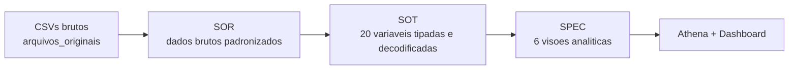

# Estrutura de Dados | PNAD-COVID

<p align="left">
   
   
   
   
</p>

Documento tecnico da estrutura de dados, separado da analise de negocio.

## Sumario

- [Panorama](#panorama)
- [Fluxo de Dados](#fluxo-de-dados)
- [Arquitetura de Pastas](#arquitetura-de-pastas)
- [Modelo por Camada](#modelo-por-camada)
- [Detalhes Tecnicos de Implementacao](#detalhes-tecnicos-de-implementacao)
- [Particionamento e Performance](#particionamento-e-performance)
- [Qualidade e Consistencia](#qualidade-e-consistencia)
- [Execucao do Pipeline](#execucao-do-pipeline)
- [Arquivos de Apoio](#arquivos-de-apoio)

---

## Panorama

| Item | Valor |
|---|---|
| Fonte | Microdados PNAD-COVID (IBGE) |
| Periodo | 202009, 202010, 202011 |
| Volume final | 1.149.197 registros |
| Formato | Parquet (Snappy) |
| Camadas | SOR, SOT, SPEC |
| Banco Athena | pnad_covid |

---

## Fluxo de Dados



---

## Arquitetura de Pastas

```text
Tech Challenge/
|-- arquivos_originais/
|   |-- 202009/PNAD_COVID_092020.csv
|   |-- 202010/PNAD_COVID_102020.csv
|   `-- 202011/PNAD_COVID_112020.csv
|-- sor/
|   |-- script_sor.py
|   |-- athena_create_table_sor.sql
|   |-- dados/pnad_covid_sor.parquet/ano_mes=202009/
|   |-- dados/pnad_covid_sor.parquet/ano_mes=202010/
|   |-- dados/pnad_covid_sor.parquet/ano_mes=202011/
|   `-- preview/sor_preview_AAAAMM.csv
|-- sot/
|   |-- script_sot.py
|   |-- athena_create_table_sot.sql
|   |-- dados/pnad_covid_sot.parquet/ano_mes=202009/
|   |-- dados/pnad_covid_sot.parquet/ano_mes=202010/
|   |-- dados/pnad_covid_sot.parquet/ano_mes=202011/
|   `-- preview/sot_preview_AAAAMM.csv
`-- spec/
      |-- script_spec.py
      |-- athena_create_table_spec.sql
      |-- querys_analise_spec.sql
   |-- insights_spec.md
      |-- dados/*.parquet
      `-- preview/*_preview.csv
```

---

## Modelo por Camada

### SOR

| Atributo | Descricao |
|---|---|
| Finalidade | Preservar dados brutos com historico mensal |
| Tabela Athena | pnad_covid.sor_pnad_covid_bruto |
| Granularidade | Registro individual da pesquisa |
| Particao | ano_mes (STRING) |
| Tipagem | Predominantemente STRING |

> Observacao de schema: setembro e outubro possuem 145 colunas; novembro possui 148.

### SOT

| Atributo | Descricao |
|---|---|
| Finalidade | Conjunto confiavel e padronizado para analise |
| Tabela Athena | pnad_covid.sot_pnad_covid_tratado |
| Granularidade | Registro individual da pesquisa |
| Particao | ano_mes (STRING) |
| Estrutura | 42 colunas (20 variaveis base + derivados) |

<details>
<summary><strong>Grupos de atributos da SOT</strong></summary>

- Demograficos: UF, mes, area, idade, sexo, cor/raca, escolaridade
- Saude: sintomas, procura por atendimento, internacao, plano de saude
- Socioeconomicos/comportamento: isolamento, trabalho, remoto, beneficios
- Derivados: nome_uf, regiao, descricoes textuais, faixa_etaria, mes_desc

</details>

### SPEC

| Tabela | Chaves de agregacao | Medidas principais |
|---|---|---|
| pnad_covid.spec_sintomas_por_perfil | ano_mes, mes_desc, faixa_etaria, sexo_desc, regiao | contagens e percentuais de sintomas |
| pnad_covid.spec_busca_atendimento | ano_mes, mes_desc, faixa_etaria, sexo_desc, regiao | procura por saude, internacao, plano |
| pnad_covid.spec_impacto_economico | ano_mes, mes_desc, faixa_etaria, sexo_desc, cor_raca_desc, escolaridade_desc | trabalho, remoto, auxilios |
| pnad_covid.spec_comportamento_pandemia | ano_mes, mes_desc, faixa_etaria, sexo_desc, regiao, escolaridade_desc | restricao de contato e exposicao |
| pnad_covid.spec_indicadores_regionais | ano_mes, mes_desc, uf, nome_uf, regiao | consolidado por UF/regiao |
| pnad_covid.spec_evolucao_mensal | ano_mes, mes_desc | KPI mensais consolidados |

---

## Detalhes Tecnicos de Implementacao

### Entradas e saidas por script

| Script | Entrada | Saida |
|---|---|---|
| sor/script_sor.py | arquivos_originais/202009, 202010, 202011 (CSV) | sor/dados/pnad_covid_sor.parquet + sor/preview/*.csv |
| sot/script_sot.py | sor/dados/pnad_covid_sor.parquet | sot/dados/pnad_covid_sot.parquet + sot/preview/*.csv |
| spec/script_spec.py | sot/dados/pnad_covid_sot.parquet | spec/dados/*.parquet + spec/preview/*_preview.csv |

### Padronizacao de schema (multi-mes)

1. Meses 202009 e 202010 possuem 145 colunas.
2. Mes 202011 possui 148 colunas.
3. A camada SOR faz compatibilizacao para unificar o schema antes da persistencia.

### Regras de transformacao da SOT

1. Selecao de 20 variaveis de negocio definidas no desafio.
2. Conversao de tipos para colunas numericas de interesse.
3. Decodificacao de categorias (UF, regiao, sexo, cor/raca, escolaridade etc.).
4. Criacao de atributos derivados, como faixa_etaria e mes_desc.

### Persistencia e formato

1. Escrita em Parquet com compressao Snappy.
2. SOR e SOT particionadas por ano_mes.
3. SPEC mantem ano_mes como coluna para filtros temporais.

### SQL e consumo no Athena

1. Cada camada possui script DDL proprio (athena_create_table_*.sql).
2. SOR e SOT exigem MSCK REPAIR TABLE apos carga no S3.
3. As consultas de validacao analitica estao em spec/querys_analise_spec.sql.

### Dependencias e ambiente

| Item | Uso |
|---|---|
| Python 3.11+ | Execucao dos scripts |
| PySpark 4.x | Transformacoes em DataFrame |
| pandas + pyarrow | Escrita/leitura Parquet e previews |
| Java 21+ | Runtime do Spark |

---

## Particionamento e Performance

1. SOR e SOT usam particionamento fisico por ano_mes.
2. SPEC usa arquivos por visao, mantendo ano_mes como coluna analitica.
3. No Athena, filtros por ano_mes reduzem custo de leitura.
4. Compression Snappy melhora tempo de scan e custo-beneficio.

---

## Qualidade e Consistencia

| Regra | Criterio esperado |
|---|---|
| Integridade temporal | Meses presentes: 202009, 202010, 202011 |
| Integridade de volume | Soma mensal = 1.149.197 |
| Integridade de schema | 20 variaveis base na SOT |
| Integridade analitica | SPEC alinhada ao periodo da SOT |

---

## Execucao do Pipeline

```bash
python sor/script_sor.py
python sot/script_sot.py
python spec/script_spec.py
```

Ordem no Athena:

1. sor/athena_create_table_sor.sql
2. sot/athena_create_table_sot.sql
3. spec/athena_create_table_spec.sql
4. MSCK REPAIR TABLE nas tabelas particionadas (SOR e SOT)

---

## Arquivos de Apoio

- Analise de negocio: spec/insights_spec.md
- Consultas de validacao: spec/querys_analise_spec.sql
